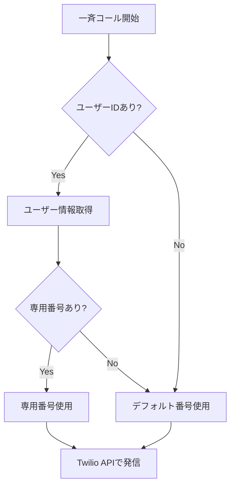

# 電話番号管理システムの実装状況

## 概要
現在のシステムでは、TwilioとPhonePoolを使用した電話番号管理を実装していますが、実際の運用では以下の構成になっています。

## 電話番号の取得と管理方法

### 1. PhonePool モデル (`backend/models/PhonePool.js`)
- **目的**: 複数の電話番号をプールして管理するためのモデル
- **主な機能**:
  - 電話番号のステータス管理（available, in_use, reserved, maintenance）
  - 会社・ユーザーへの番号割り当て
  - 使用統計の記録

### 2. PhonePoolService (`backend/services/phonePoolService.js`)
- **主な機能**:
  - `purchaseNewNumber()`: Twilioから新しい番号を購入してプールに追加
  - `importExistingNumbers()`: 既存のTwilio番号をプールにインポート
  - `allocateNumberForSession()`: セッション用に番号を割り当て
  - `releaseNumber()`: 使用後の番号を解放

## 一斉コール時の電話番号使用

### 現在の実装 (`backend/controllers/bulkCallController.js`)

```javascript
// bulkCallController.js - initiateBulkCalls メソッド
const callPromise = twilioService.makeCall(phoneNumber, session._id, req.user?.id)
```

### TwilioService での番号選択ロジック (`backend/services/twilioService.js`)

1. **デフォルト番号**: 環境変数の `TWILIO_PHONE_NUMBER` を使用
2. **ユーザー専用番号の確認**:
   - ユーザーIDが提供された場合、そのユーザーの専用番号を確認
   - `user.hasActiveTwilioNumber()` で専用番号の有無をチェック
   - `user.getDedicatedTwilioNumber()` で専用番号を取得

```javascript
// twilioService.js - makeCall メソッド内
let fromNumber = twilioPhoneNumber; // デフォルト

if (userId) {
  const user = await User.findById(userId);
  if (user && user.hasActiveTwilioNumber()) {
    fromNumber = user.getDedicatedTwilioNumber();
  }
}
```

## 取次機能での電話番号使用

### HandoffController (`backend/controllers/handoffController.js`)

取次機能では現在、**固定の電話番号**を使用しています：

```javascript
// handoffController.js - initiateHandoff/initiateHandoffByPhone メソッド
const agentPhoneNumber = '+818070239355';  // 固定の取次先電話番号
```

### 取次の流れ
1. 顧客からの通話中に取次要求を受ける
2. 固定番号（+818070239355）に発信
3. Twilioのカンファレンス機能を使用して顧客と担当者を接続

## 現状の問題点と改善案

### 問題点
1. **PhonePoolが未活用**: PhonePoolモデルとサービスは実装されているが、実際の通話では使用されていない
2. **固定番号の使用**: 取次先が固定されており、柔軟性に欠ける
3. **番号管理の非効率性**: 複数の番号を保有している場合でも、効率的に使い分けられていない

### 改善案
1. **PhonePoolの活用**:
   - 一斉コール時に複数の番号をローテーションで使用
   - 会社ごとに専用番号を割り当て

2. **動的な番号割り当て**:
   - セッションごとに利用可能な番号を動的に割り当て
   - 負荷分散と番号の効率的な利用

3. **取次先の柔軟な設定**:
   - ユーザーごとに取次先電話番号を設定可能にする
   - データベースで管理して動的に取得

## 設定ファイル

### 環境変数 (`.env`)
```
TWILIO_ACCOUNT_SID=<アカウントSID>
TWILIO_AUTH_TOKEN=<認証トークン>
TWILIO_PHONE_NUMBER=<デフォルトの発信元番号>
```

### 現在の番号取得フロー



## まとめ
現在のシステムは、PhonePoolによる高度な番号管理機能を持っていますが、実際の運用では主に環境変数のデフォルト番号とユーザーの専用番号のみを使用しています。取次機能では固定番号（+818070239355）が使用されており、より柔軟な番号管理システムへの移行が推奨されます。